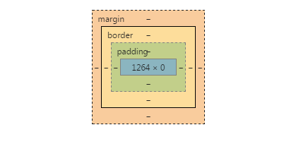

#BFC#
###什么是BFC?
>Formatting context 是 W3C CSS2.1 规范中的一个概念。它是页面中的一块渲染区域，并且有一套渲染规则，它决定了其子元素将如何定位，以及和其他元素的关系和相互作用。最常见的 Formatting context 有 Block fomatting context (简称BFC)和 Inline formatting context (简称IFC)。

###通俗的理解

BFC(Block formatting context)直译为"块级格式化上下文"。它是一个独立的渲染区域，只有Block-level box参与， 它规定了内部的Block-level Box如何布局，并且与这个区域外部毫不相干。

###BFC布局规则
+  内部的Box会在垂直方向，一个接一个地放置。
+  Box垂直方向的距离由margin决定。属于同一个BFC的两个相邻Box的margin会发生重叠。
+  每个元素的margin box的左边， 与包含块border box的左边相接触(对于从左往右的格式化，否则相反)。即使存在浮动也是如此。
+  BFC的区域不会与float box重叠。
+  BFC就是页面上的一个隔离的独立容器，容器里面的子元素不会影响到外面的元素。反之也如此。
+  计算BFC的高度时，浮动元素也参与计算.
###怎样形成BFC
+ float属性不为none
+ position为absolute或fixed
+ display为inline-block, table-cell, table-caption, flex, inline-flex
+ overflow不为visible
###为什么会形成BFC?
页面在渲染的时候从上到下，从左到右布局，根据html元素的本身属性（inline or block）和自己写的css来计算元素的位置。html元素有自己的一系列属性，其中包含 __块__ **层** 的属性。

+  **块** 就是上面说的是inline还是block，
+  **[层]()** 是什么？在渲染的时候，像，canvas,video这样的元素和普通的元素不在同一个层级，这是因为这些元素在渲染时需要处理大量的数据，单独开辟一个层级使他们在渲染的时候更快。层级这个概念在开发中经常会遇到，float，position，都会形成自己的层级，这也就是为什么浮动和定位会引起元素的底下元素的上移。

#####在理解上面的知识后，从一个浮动这个点来切入BFC。

###BFC解决浮动引发的问题
+ 元素上浮：元素上浮，就是因为浮动的元素脱离了文档流，创建了自己层级，既然脱离了文档流，那么底下的元素按照从上到下，从左到右的布局原则，自然要上浮。使用clear可以清除浮动，但是BFC也可以清除浮动，解决上浮的问题，但两者还是有一些区别
	
		.fla{
			width: 100px;
			height: 100px;
			background-color:red;
			float: left;

		}
		.div{
			width: 100px;
			height: 100px;
			background-color: blue;
			clear: both;
		}

		

		

效果

	
			.fla{
			width: 100px;
			height: 100px;
			background-color:red;
			float: left;

		}
		.div{
			width: 100px;
			height: 100px;
			background-color: blue;
			overflow: hidden;
		}
效果

准确来说使用BFC不是一种清除浮动方案，而是一种解决上浮的方案，`overflow:hidden` 这种方式遵循上面提到的布局方案，不受其他元素的影响，所以布局到了浮动元素的右侧，遵循从上到下，从左到右的原则。

###清除坍塌
当父元素包含的子元素浮动时，父元素会出现坍塌，

		.fla{
			/*width: 100px;
			height: 100px;*/	
		}
		.div{
			width: 100px;
			height: 100px;
			background-color: blue;
			float: left;
		}
		

			

		

效果

可以看到父元素根本没有高度，宽度是默认的。
	
			.fla{
			/*width: 100px;
			height: 100px;*/
			overflow: hidden;
		}
		.div{
			width: 100px;
			height: 100px;
			background-color: blue;
			float: left;
		}

效果

高度出来了，并且布局原则是从上到下，从左到右。

###margin重叠问题
什么是margin重叠?
当父元素，和子元素同时具有margin时，margin会进行重叠，重叠规则，

#总结
+ 形成BFC之后，具有BFC特性的元素按照原始的布局方式进行布局，不受外界的影响。
+ BFC能解决布局上的缺陷，
	

